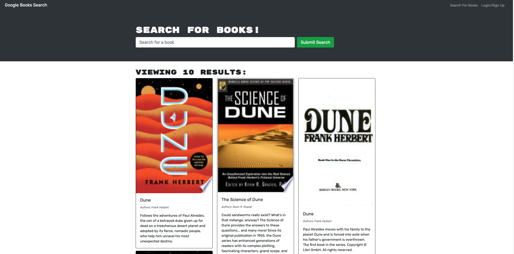
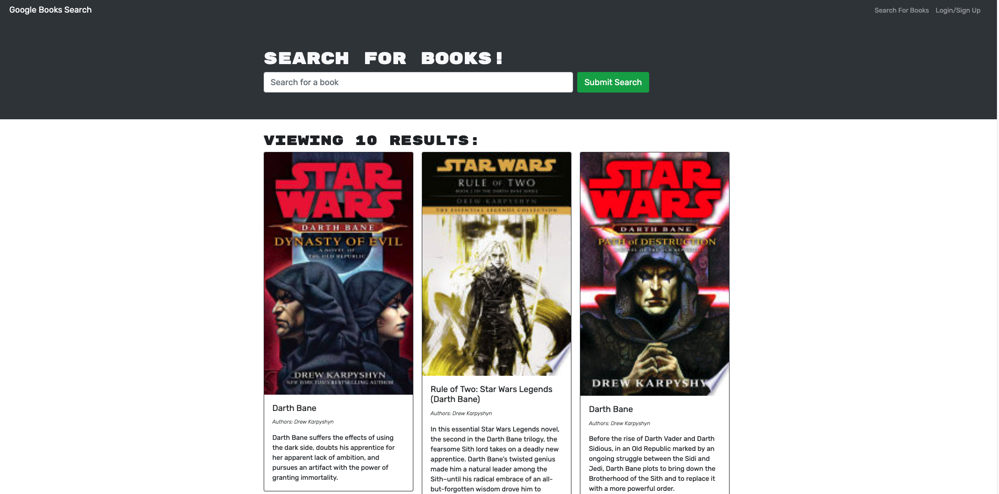

# Book-Search-Engine

 
 

## **Description**
* A useful way to find the books you want and save/delete them from your list.
 
 

## **Table of Contents**
- [Installation](#Installation)  
- [Usage](#Usage)  
- [License](#License)  
- [Contributing](#Contributing)  
- [Tests](#Tests)  
- [Questions](#Questions)  
 
 

## **Installation**
* There is no installation.
 
 

## **Usage**
* Sign in and search for the books you want. Then add them to your list. If you don't want them, delete them from your list.
 
 

## **License**
### *MIT*  
        A short and simple permissive license with conditions only requiring preservation of copyright and license notices. Licensed works, modifications, and larger works may be distributed under different terms and without source code.
 

## **Contributing**
* No contributions at this time.
 
 

## **Tests**
    
* No tests
 
 

## **Questions**
* GitHub: https://github.com/KevinHenleyCode

* For more questions you can reach me at my Email:(kevinhenleyinfo@gmail.com)

 
 

## **Screenshot**

 
 

## **Links**
[Site](https://intense-harbor-64465.herokuapp.com/)